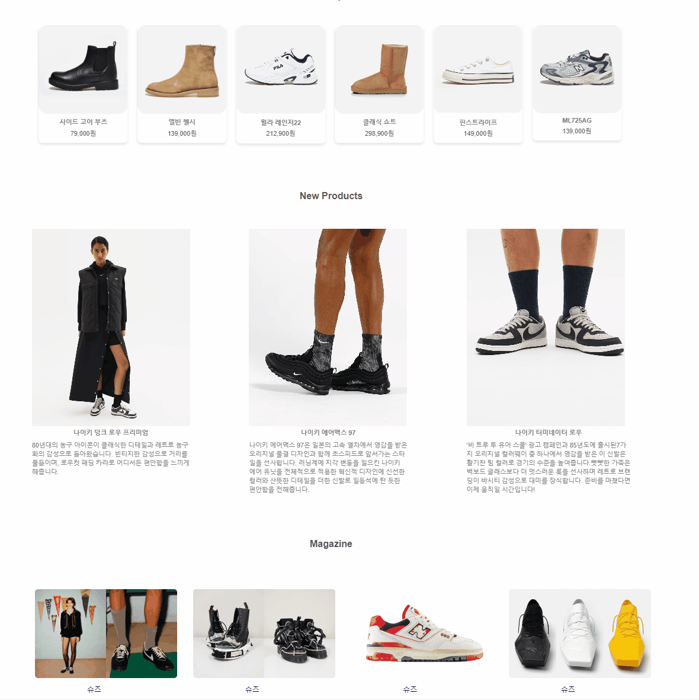
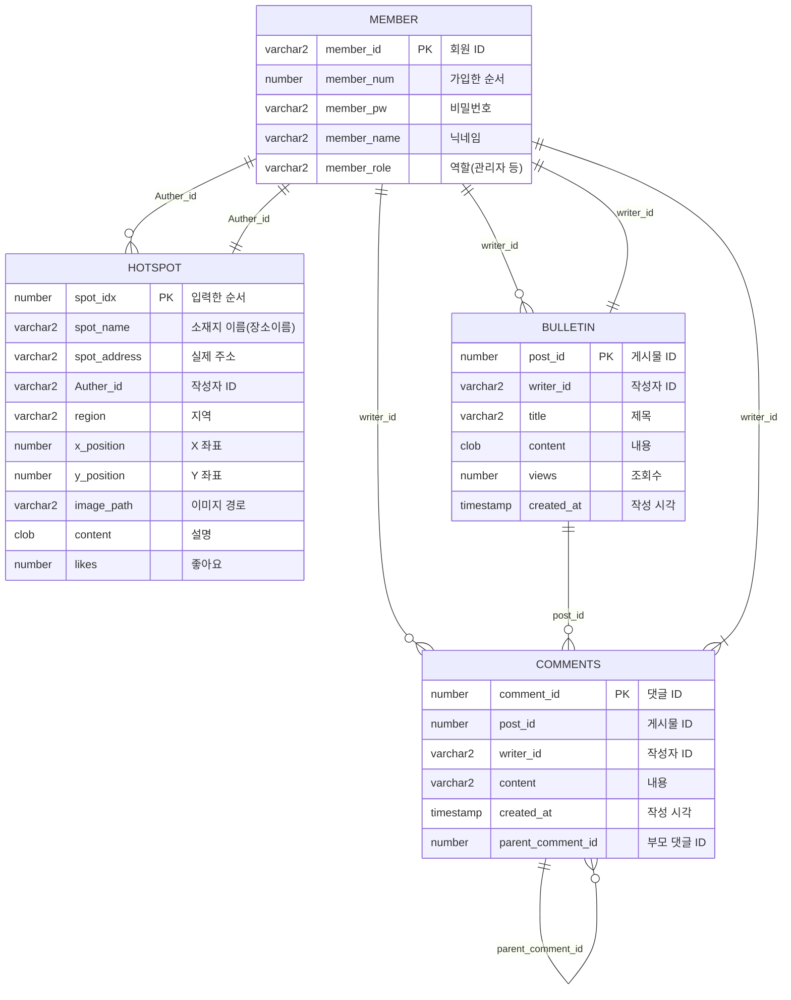

# ShoesLAB project  
신발을 판매하는 사이트로 실시간 조회수를 차트로 시각화하여 보다 편리하게 소비자들이 원하는 상품을 구매할 수 있다.
또한 매거진과, 차트를 통해 최신 트렌드를 쉽게 접할 수 있다.  
.[AWS 실행환경](http://3.26.21.189:3000/)
## 프로젝트 개요
+ 프로젝트 이름: ShoesLAB
+ 프로젝트 기간: 2024.01.11-2024.01.18
+ 개발 언어: HTML, CSS, Javascript, Jqeury
+ 팀원: 김대근, 위지은, 최원호, 조수호

#### 담당업무 

김대근  
```
- 메인페이지 : 전체적인 UI를 담당하였고, 사용자가 보는 첫 화면인 만큼 보기 편하게 구성하였다.
```

위지은 
```
 상세페이지 :  제품 사진을 다른 화면과 연동,사진 커서 이동시 사이즈 변동,버튼추가,네비게이션바등을 이용하여 화면을 구성하였다.       
 로그인 & 회원가입  :  버튼,움직이는 배경화면,다른 화면과 연동등을 사용하여 화면을 구성하였다.
 getbootstrap과 abc마켓의 자료들을 참고하여 작성하였다.
``` 

최원호
```
 실시간차트 바인딩: 조회수를 JSON으로 객체화한 후 차트에서 조회하여 시각화
 장바구니 계산: 소비자가 선택한 상품을 localStorage에 담아 구매싸이트로 데이터를 전송하여 바인딩함
``` 
조수호   
```
 랜딩페이지: 상단 부분 문구를 클릭하면 회원가입 페이지, 로그인 페이지로 바로 이동할 수 있게 구현했고
 이미지 슬라이더와 메인 페이지로 갈 수 있는 버튼을 추가
 챗봇: 챗봇이 질문을 하면 사용자들이 원하는 상품들을 쉽게 찾을 수 있게 텍스트 입력과 버튼식 두가지로 기능 구현
```
##### 주요기능
   
  | 랜딩페이지 | 메인페이지 | 카테고리 | 장바구니 |
  |---|---|---|---|
  || |이미지|이미지|

  | 조회수 | 챗봇 | 로그인 | 오시는길 |
  |---|---|---|---|
  |이미지|이미지|이미지|이미지|
 

###### 향후 과제 
- 장바구니에서 구매가 실질적으로 동작할 수 있도록 싸이트에 신용카드 결제 모듈연동  
- 신발 카테고리별로 조회수가 반영될 수 있도록 범주화. 현재는 개별 상품의 조회수만 차트화  
- 제품 상세페이지 자료 전부 연동  
- 회원가입 유효성검사 비밀번호 js파일 수정아 더 필요함  
- 챗봇 모든 질문과 답변이 끝나면 다시 첫 질문으로 돌아갈 수 있게 구현하기

# 탭이름 오른쪽키 화면 미리보기
## md파일은 markdown 화면 보인다.
목록
- 첫번째
+ 두번째
  1. 숫자목록
  2. 하하
1. 빼기 누르니 하위로 가네

> 있어보이는말
> 줄바꿈은 마지막에 띄어쓰기 두번!!  
>      앞에 띄어쓰기 인식안하네

`세개쓰면 코드 블록
`세개 쓰고 언어이름 쓰면 해당 언어로 색깔 칠해줌
java
```java
public static void main(){

}
```
방금 신기했음.. 쓰는동안 다른언어 색깔 적용되는게
터미널은 shell
```shell 오 빈칸되네



>  
get : `/main`
#### 1.main
- [ ] id 유효성 검사 fromt에서도 검증하기
- [ ] name 유효성 검사 fromt에서도 검증하기

